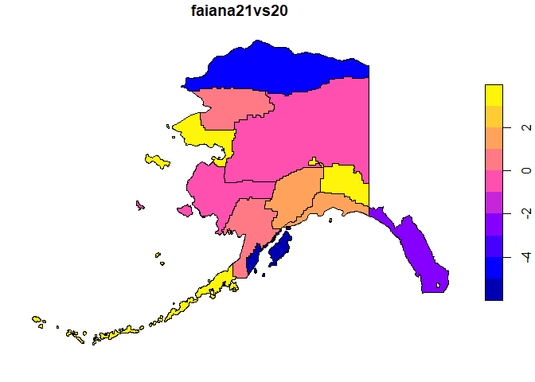

<!-- README.md is generated from README.Rmd. Please edit that file -->

# geogenr <a href="https://josesamos.github.io/geogenr/"></a>

<!-- badges: start -->

[](https://CRAN.R-project.org/package=geogenr)
[](https://github.com/josesamos/geogenr/actions/workflows/R-CMD-check.yaml)
[](https://app.codecov.io/gh/josesamos/geogenr?branch=master)
<!-- badges: end -->

<!-- [](https://www.r-pkg.org:443/pkg/geogenr) -->

The [American Community Survey
(ACS)](https://www.census.gov/programs-surveys/acs) offers geodatabases
with geographic information and associated data of interest to
researchers in the area. The goal of `geogenr` is to facilitate access
to this information through functions that allow us to select the
geodatabases that interest us, download them, access the information
they contain, filter it and export it in various formats so that we can
process it with other tools if required.

## Installation

You can install the released version of `geogenr` from
[CRAN](https://CRAN.R-project.org) with:

``` r
install.packages("geogenr")
```

And the development version from [GitHub](https://github.com/) with:

``` r
# install.packages("devtools")
devtools::install_github("josesamos/geogenr")
```

## Example

Each ACS geodatabase is structured in layers: a geographic layer, a
metadata layer, and the rest are data layers. Accessing data with this
structure is not trivial. The goal of the `geogenr` package is to make
it easier.

First, we select and download the ACS geodatabases that we need. We can
use the functions offered by the package or download and decompress them
by other means. We create an object of class `acs_5yr` indicating the
work folder.

``` r
library(geogenr)

dir <- system.file("extdata/acs_5yr", package = "geogenr")

ac <- acs_5yr(dir)
```

We can query the available geodatabases by area, subject and year using
the methods offered by the object. We also download the geodatabases of
the areas and years that we need.

``` r
ac |>
  get_area_groups()
#> [1] "Legal and Administrative Areas" "Statistical Areas"

ac |>
  get_areas(group = "Legal and Administrative Areas")
#>  [1] "American Indian/Alaska Native/Native Hawaiian Area"
#>  [2] "Alaska Native Regional Corporation"                
#>  [3] "Congressional District (116th Congress)"           
#>  [4] "County"                                            
#>  [5] "Place"                                             
#>  [6] "Elementary School District"                        
#>  [7] "Secondary School District"                         
#>  [8] "Unified School District"                           
#>  [9] "State"                                             
#> [10] "State Legislative Districts Upper Chamber"         
#> [11] "State Legislative Districts Lower Chamber"         
#> [12] "Code Tabulation Area"

ac |>
  get_area_years(area = "Alaska Native Regional Corporation")
#> [1] "2013" "2014" "2015" "2016" "2017" "2018" "2019" "2020" "2021"

ac <- ac |>
  select_area_files("Alaska Native Regional Corporation", 2020:2021)

files <- ac |>
  download_selected_files(unzip = FALSE)
```

    #> [1] TRUE TRUE

We unzip the files and check that the data is available.

``` r
files <- ac |>
  unzip_files()

ac |>
  get_available_areas()
#> [1] "Alaska Native Regional Corporation"

ac |>
  get_available_area_years(area = "Alaska Native Regional Corporation")
#> [1] "2020" "2021"
```

We consult the themes available in the selected area and also select one
or more themes by creating an object of class `acs_5yr_topic`.

``` r
ac |>
  get_available_area_topics("Alaska Native Regional Corporation")
#>  [1] "X01 Age And Sex"                     "X02 Race"                           
#>  [3] "X03 Hispanic Or Latino Origin"       "X04 Ancestry"                       
#>  [5] "X05 Foreign Born Citizenship"        "X06 Place Of Birth"                 
#>  [7] "X07 Migration"                       "X08 Commuting"                      
#>  [9] "X09 Children Household Relationship" "X10 Grandparents Grandchildren"     
#> [11] "X11 Household Family Subfamilies"    "X12 Marital Status And History"     
#> [13] "X13 Fertility"                       "X14 School Enrollment"              
#> [15] "X15 Educational Attainment"          "X16 Language Spoken At Home"        
#> [17] "X17 Poverty"                         "X18 Disability"                     
#> [19] "X19 Income"                          "X20 Earnings"                       
#> [21] "X21 Veteran Status"                  "X22 Food Stamps"                    
#> [23] "X23 Employment Status"               "X24 Industry Occupation"            
#> [25] "X25 Housing Characteristics"         "X26 Group Quarters"                 
#> [27] "X27 Health Insurance"                "X28 Computer And Internet Use"      
#> [29] "X99 Imputation"

act <- ac |>
  as_acs_5yr_topic("Alaska Native Regional Corporation",
                   topic = "X01 Age And Sex")
```

Once a topic has been selected, we can consult the available reports or
subreports. We can focus on a report or subreport, we can also work with
all the reports of the topic.

``` r
act |>
  get_report_names()
#> [1] "B01001-Sex By Age"        "B01002-Median Age By Sex"
#> [3] "B01003-Total Population"
```

We can export the reports of the selected topic to various formats such
as `GeoPackage`, also `flat_table` or `star_schema` of the
[`rolap`](https://cran.r-project.org/package=rolap) package. In this
case we are going to obtain a `GeoPackage`.

``` r
geo <- act |>
  as_acs_5yr_geo()

dir <- tempdir()
file <- geo |>
  as_GeoPackage(dir)

sf::st_layers(file)
#> Driver: GPKG 
#> Available layers:
#>   layer_name geometry_type features fields crs_name
#> 1       data Multi Polygon       12   1453    NAD83
#> 2   metadata            NA     1436     12     <NA>
#> 3     origin            NA        2      6     <NA>
```

This format also allows us to perform simple queries using the metadata
and the geographic layer.

``` r
metadata <- geo |>
  get_metadata()

metadata
#> # A tibble: 1,436 × 12
#>    variable year  Short_Name Full_Name   report subreport report_var report_desc
#>    <chr>    <chr> <chr>      <chr>       <chr>  <chr>          <int> <chr>      
#>  1 V0001    2020  B01001Ae1  Sex By Age… B01001 A                  1 Sex By Age…
#>  2 V0002    2020  B01001Ae10 Sex By Age… B01001 A                 10 Sex By Age…
#>  3 V0003    2020  B01001Ae11 Sex By Age… B01001 A                 11 Sex By Age…
#>  4 V0004    2020  B01001Ae12 Sex By Age… B01001 A                 12 Sex By Age…
#>  5 V0005    2020  B01001Ae13 Sex By Age… B01001 A                 13 Sex By Age…
#>  6 V0006    2020  B01001Ae14 Sex By Age… B01001 A                 14 Sex By Age…
#>  7 V0007    2020  B01001Ae15 Sex By Age… B01001 A                 15 Sex By Age…
#>  8 V0008    2020  B01001Ae16 Sex By Age… B01001 A                 16 Sex By Age…
#>  9 V0009    2020  B01001Ae17 Sex By Age… B01001 A                 17 Sex By Age…
#> 10 V0010    2020  B01001Ae18 Sex By Age… B01001 A                 18 Sex By Age…
#> # ℹ 1,426 more rows
#> # ℹ 4 more variables: measure <chr>, item1 <chr>, item2 <chr>, group <chr>

metadata <-
  dplyr::filter(
    metadata,
    item2 == "Female" &
      group == "People Who Are American Indian And Alaska Native Alone" &
      measure == "estimate"
  )

geo2 <- geo |>
  set_metadata(metadata)

geo2 |>
  get_metadata()
#> # A tibble: 2 × 12
#>   variable year  Short_Name Full_Name    report subreport report_var report_desc
#>   <chr>    <chr> <chr>      <chr>        <chr>  <chr>          <int> <chr>      
#> 1 V0671    2020  B01002Ce3  Median Age … B01002 C                  3 Median Age…
#> 2 V1389    2021  B01002Ce3  Median Age … B01002 C                  3 Median Age…
#> # ℹ 4 more variables: measure <chr>, item1 <chr>, item2 <chr>, group <chr>

geo_layer <- geo2 |> 
  get_geo_layer()

geo_layer$faiana21vs20 <- 100 * (geo_layer$V1389 - geo_layer$V0671) / geo_layer$V0671
plot(geo_layer[, "faiana21vs20"])
```



In `GeoPackage` format we can also easily perform queries with other
tools such as *QGIS*.
