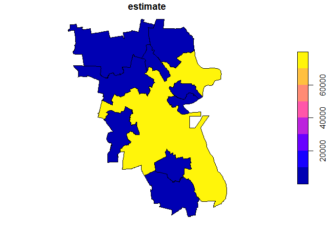

<!-- README.md is generated from README.Rmd. Please edit that file -->

# geogenr: Geomultistar Generator from American Community Survey (ACS) Geodatabases

<!-- badges: start -->

[](https://travis-ci.com/josesamos/geogenr)
<!-- badges: end -->

The [American Community Survey
(ACS)](https://www.census.gov/programs-surveys/acs) offers geodatabases
with geographic information and associated data of interest to
researchers in the area. The goal of `geogenr` is to generate
`geomultistar` objects from those geodatabases automatically, once the
focus of attention is selected.

## Installation

You can install the released version of geogenr from
[CRAN](https://CRAN.R-project.org) with:

``` r
install.packages("geogenr")
```

And the development version from [GitHub](https://github.com/) with:

``` r
# install.packages("devtools")
devtools::install_github("josesamos/geogenr")
```

## Example

Each ACS geodatabase is structured in layers: a geographic layer, a
metadata layer, and the rest are data layers. The data layers have a
matrix form, the rows are indexed by instances of the geographic layer,
the columns by variables defined in the metadata layer, the cells are
numeric values. Here we have an example:

`GEOID B01001e1 B01001m1 B01001e2 B01001m2 B01001e3 B01001m3 B01001e4
B01001m4 ...`

`16000US0100100 218 165 92 114 10 16 18 30`

`16000US0100124 2582 24 1313 98 45 37 14 19`

`16000US0100460 4374 24 1963 158 144 76 105 68`

`16000US0100484 641 159 326 89 10 17 16 11`

`16000US0100676 295 102 143 55 7 11 14 17`

`16000US0100820 32878 57 16236 453 1159 257 1151 209`

`...`

Some of the defined variables are shown below.

`Short Name Full Name`

`B01001e1 SEX BY AGE: Total: Total Population -- (Estimate)`

`B01001m1 SEX BY AGE: Total: Total Population -- (Margin of Error)`

`B01001e2 SEX BY AGE: Male: Total Population -- (Estimate)`

`B01001m2 SEX BY AGE: Male: Total Population -- (Margin of Error)`

`B01001e3 SEX BY AGE: Male: Under 5 years: Total Population --
(Estimate)`

`B01001m3 SEX BY AGE: Male: Under 5 years: Total Population -- (Margin
of Error)`

`B01001e4 SEX BY AGE: Male: 5 to 9 years: Total Population --
(Estimate)`

`B01001m4 SEX BY AGE: Male: 5 to 9 years: Total Population -- (Margin of
Error)`

`...`

First, we select and download the ACS geodatabases using the functions
offered by the package. Once we have them in a folder (in this case some
examples are included in the package), this is a basic example which
shows you how to solve a common problem:

``` r
library(geogenr)

folder <- system.file("extdata", package = "geogenr")
folder <- stringr::str_replace_all(paste(folder, "/", ""), " ", "")
ua <- uscb_acs_5ye(folder = folder)

(sa <- ua %>% get_statistical_areas())
#>  [1] "Combined New England City and Town Area"   
#>  [2] "Combined Statistical Area"                 
#>  [3] "Metropolitan Division"                     
#>  [4] "Metropolitan/Micropolitan Statistical Area"
#>  [5] "New England City and Town Area"            
#>  [6] "New England City and Town Area Division"   
#>  [7] "Public Use Microdata Area"                 
#>  [8] "Tribal Block Group"                        
#>  [9] "Tribal Census Tract"                       
#> [10] "Urban Area"

(y <- ua %>% get_available_years_downloaded(geodatabase = sa[6]))
#> [1] 2014 2015

ul <- uscb_layer(uscb_acs_metadata, ua = ua, geodatabase = sa[6], year = 2015)
(layers <- ul %>% get_layer_names())
#> [1] "X00_COUNTS"      "X01_AGE_AND_SEX" "X02_RACE"

ul <- ul %>% get_layer(layers[2])
(layer_groups <- ul %>% get_layer_group_names())
#> [1] "001 - SEX BY AGE"        "002 - MEDIAN AGE BY SEX"
#> [3] "003 - TOTAL POPULATION"

ul <- ul %>% get_layer_group(layer_groups[1])

gms <- ul %>% get_geomultistar()
```

For a folder, we get the years for which we have one area geodatabases
downloaded. We select the geodatabase for a specific year
(`uscb_layer`). From among the layers and groups of variables available,
we select a layer (`get_layer`) and one of its groups
(`get_layer_group`). From the selected variables we generate a
`geomultistar` object (`get_geomultistar`).

The first rows of the dimension and fact tables are shown below.

| when\_key | year |
| :-------: | :--: |
|     1     | 2015 |

| where\_key | cnectafp | nectafp | nctadvfp |   geoid    |                    name                    |                         namelsad                          | lsad | mtfcc |   aland   |  awater  |   intptlat   |   intptlon    | shape\_length | shape\_area |    geoid\_data    |
| :--------: | :------: | :-----: | :------: | :--------: | :----------------------------------------: | :-------------------------------------------------------: | :--: | :---: | :-------: | :------: | :----------: | :-----------: | :-----------: | :---------: | :---------------: |
|     1      |   715    |  71650  |  71654   | 7165071654 |        Boston-Cambridge-Newton, MA         |        Boston-Cambridge-Newton, MA NECTA Division         |  M7  | G3220 | 3.668e+09 | 7.13e+08 | \+42.2933266 | \-071.0181929 |     7.653     |   0.4783    | 35500US7165071654 |
|     2      |   715    |  71650  |  72104   | 7165072104 |      Brockton-Bridgewater-Easton, MA       |      Brockton-Bridgewater-Easton, MA NECTA Division       |  M7  | G3220 | 352799175 | 8831197  | \+42.0216172 | \-071.0267170 |     1.077     |   0.03932   | 35500US7165072104 |
|     3      |   715    |  71650  |  73104   | 7165073104 |               Framingham, MA               |               Framingham, MA NECTA Division               |  M7  | G3220 | 532516314 | 24039093 | \+42.2761738 | \-071.4822008 |     1.738     |   0.06073   | 35500US7165073104 |
|     4      |   715    |  71650  |  73604   | 7165073604 | Haverhill-Newburyport-Amesbury Town, MA-NH | Haverhill-Newburyport-Amesbury Town, MA-NH NECTA Division |  M7  | G3220 | 702086333 | 40447613 | \+42.8671722 | \-071.0254982 |     1.416     |   0.08179   | 35500US7165073604 |
|     5      |   715    |  71650  |  74204   | 7165074204 |     Lawrence-Methuen Town-Salem, MA-NH     |     Lawrence-Methuen Town-Salem, MA-NH NECTA Division     |  M7  | G3220 | 207735751 | 9917120  | \+42.7282758 | \-071.1630701 |    0.9094     |   0.02392   | 35500US7165074204 |
|     6      |   715    |  71650  |  74804   | 7165074804 |     Lowell-Billerica-Chelmsford, MA-NH     |     Lowell-Billerica-Chelmsford, MA-NH NECTA Division     |  M7  | G3220 | 863143106 | 27403003 | \+42.6141693 | \-071.4837821 |     2.441     |   0.09771   | 35500US7165074804 |

| what\_key | short\_name |                     full\_name                     | inf\_code | group\_code | subgroup\_code | spec\_code |     inf     |   group    | subgroup | demographic\_age | demographic\_sex | demographic\_race | demographic\_total\_population | demographic\_total\_population\_spec |
| :-------: | :---------: | :------------------------------------------------: | :-------: | :---------: | :------------: | :--------: | :---------: | :--------: | :------: | :--------------: | :--------------: | :---------------: | :----------------------------: | :----------------------------------: |
|     1     | B01001\_01  |        SEX BY AGE: Total: Total Population         |    B01    |     001     |                |     1      | AGE AND SEX | SEX BY AGE |          |                  |                  |                   |             Total              |           Total Population           |
|     2     | B01001\_02  |         SEX BY AGE: Male: Total Population         |    B01    |     001     |                |     2      | AGE AND SEX | SEX BY AGE |          |                  |       Male       |                   |                                |           Total Population           |
|     3     | B01001\_03  | SEX BY AGE: Male: Under 5 years: Total Population  |    B01    |     001     |                |     3      | AGE AND SEX | SEX BY AGE |          |  Under 5 years   |       Male       |                   |                                |           Total Population           |
|     4     | B01001\_04  |  SEX BY AGE: Male: 5 to 9 years: Total Population  |    B01    |     001     |                |     4      | AGE AND SEX | SEX BY AGE |          |   5 to 9 years   |       Male       |                   |                                |           Total Population           |
|     5     | B01001\_05  | SEX BY AGE: Male: 10 to 14 years: Total Population |    B01    |     001     |                |     5      | AGE AND SEX | SEX BY AGE |          |  10 to 14 years  |       Male       |                   |                                |           Total Population           |
|     6     | B01001\_06  | SEX BY AGE: Male: 15 to 17 years: Total Population |    B01    |     001     |                |     6      | AGE AND SEX | SEX BY AGE |          |  15 to 17 years  |       Male       |                   |                                |           Total Population           |

| when\_key | where\_key | what\_key | estimate | margin\_of\_error | nrow\_agg |
| :-------: | :--------: | :-------: | :------: | :---------------: | :-------: |
|     1     |     1      |     1     | 2846699  |        131        |     1     |
|     1     |     1      |     2     | 1375801  |       2281        |     1     |
|     1     |     1      |     3     |  77814   |        988        |     1     |
|     1     |     1      |     4     |  79159   |       1452        |     1     |
|     1     |     1      |     5     |  81751   |       1305        |     1     |
|     1     |     1      |     6     |  50465   |        819        |     1     |

Once we have a `geomultistar` object, we can use the functionality of
[`starschemar`](https://CRAN.R-project.org/package=starschemar) and
[`geomultistar`](https://CRAN.R-project.org/package=geomultistar)
packages to define multidimensional queries with geographic information.

``` r
library(starschemar)
library(geomultistar)

gms <- gms  %>%
  define_geoattribute(
    attribute = c("name"),
    from_attribute = "geoid"
  )

gdqr <- dimensional_query(gms) %>%
  select_dimension(name = "where",
                   attributes = c("name")) %>%
  select_dimension(
    name = "what",
    attributes = c("short_name")
  ) %>%
  select_fact(name = "sex_by_age",
              measures = c("estimate")) %>%
  filter_dimension(name = "when", year == "2015") %>%
  filter_dimension(name = "what",
                   demographic_age == "Under 5 years") %>%
  run_geoquery()
```

The result is a vector layer that we can save, perform spatial analysis
or queries on it, or we can see it as a map, using the functions
associated with the `sf` class.

``` r
plot(gdqr[,"estimate"])
```



Once we have verified that the data for the reference year is what we
need, we can expand our database considering the rest of the years
available in the folder. The only requirement to consider a year is that
its variable structure be the same as that of the reference year.

``` r
uf <- uscb_folder(ul)

cgms <- uf %>% get_common_geomultistar()
```

Instead of displaying all the tables, we focus on the table in the
*when* dimension.

| when\_key | year |
| :-------: | :--: |
|     1     | 2014 |
|     2     | 2015 |

Includes data for all available years.
